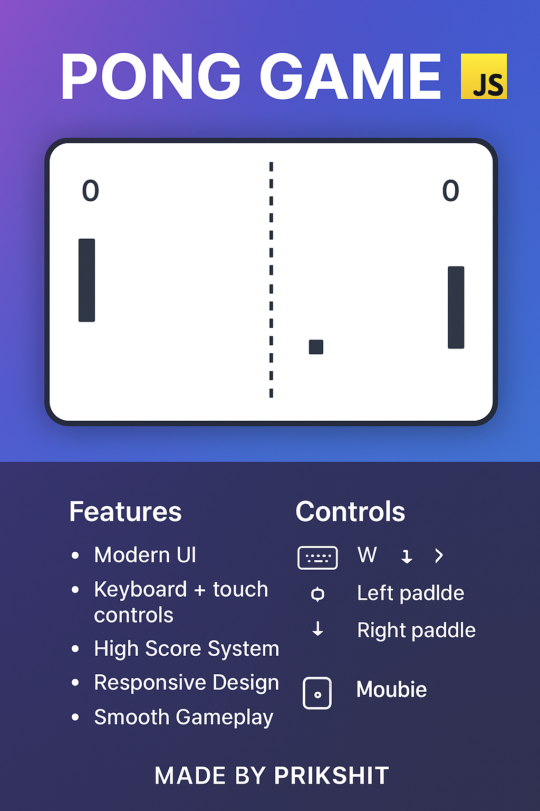

# 🎮 Pong Game in JavaScript  

A modern twist on the **classic Pong game** 🏓 — built using **HTML, CSS, and JavaScript**.  
This project was created with the help of **ChatGPT 🤖** and designed by **Prikshit**.  

  
    

---

## 🚀 Features
- 🎨 **Modern UI** — gradient background & clean design  
- 🕹️ **Controls** — keyboard + mobile touch buttons  
- 📊 **High Score System** — saved with `localStorage`  
- 📱 **Responsive Design** — works on desktop & mobile  
- ⚡ **Smooth Gameplay** with collision physics  

---

## 🖥️ Demo
👉 [Play the game online](#) *(Add your GitHub Pages or hosting link here once deployed)*  

---

## 🎮 Controls

### ⌨️ Desktop:
- **Left Paddle** → `W` (up) / `S` (down)  
- **Right Paddle** → `↑` (up) / `↓` (down)  

### 📱 Mobile:
- On-screen buttons for both paddles  

---

## 🖼️ Preview

<p align="center">
  
</p>
---

## 🛠️ Installation
1. Clone the repository:  
   ```bash
   git clone https://github.com/prikshit957/pong-game.git
